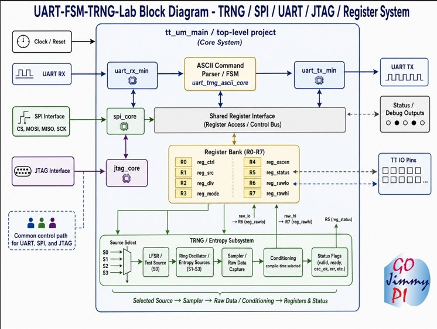
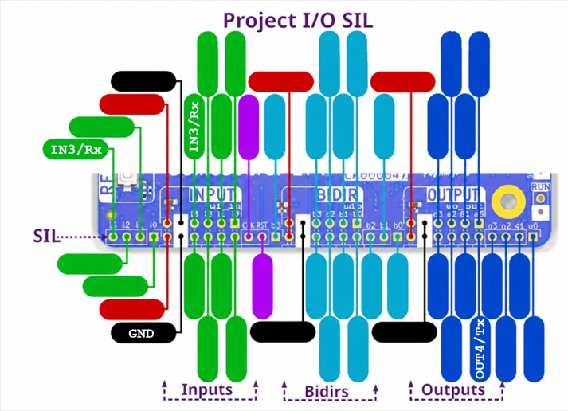
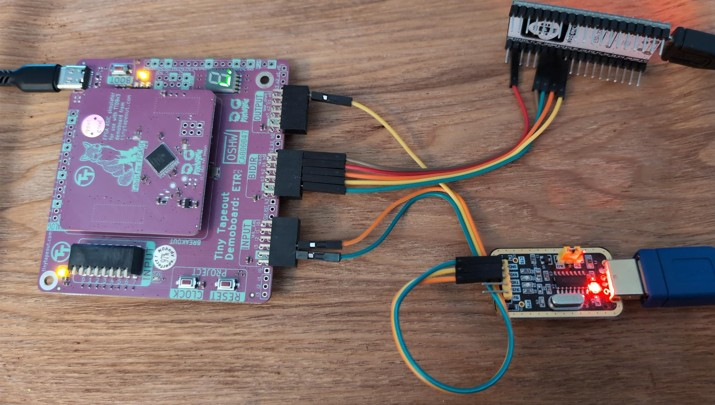
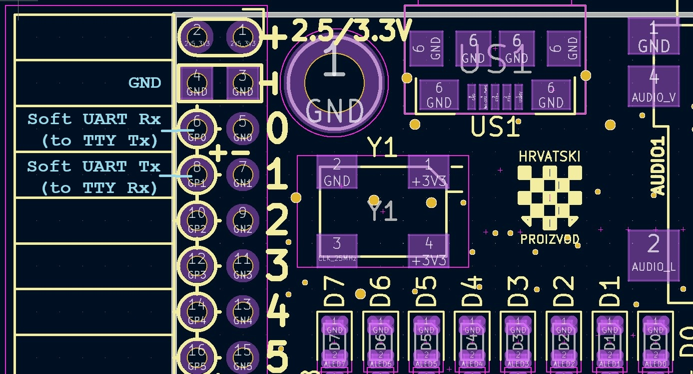

<!---

This file is used to generate your project datasheet. Please fill in the information below and delete any unused
sections.

You can also include images in this folder and reference them in the markdown. Each image must be less than
512 kb in size, and the combined size of all images must be less than 1 MB.

Ensure full URL paths are included for files outside this directory, as the full repo is not used for publishing.
-->

## How it works

This is the experimental project version that enables `ua[0..5]`.

A [ring oscillator](https://en.wikipedia.org/wiki/Ring_oscillator) is implemented at the core of this project as an 
[entropy](https://en.wikipedia.org/wiki/Entropy) source for a TRNG (True [Hardware Random Number Generator](https://en.wikipedia.org/wiki/Hardware_random_number_generator)).



This project exposes a UART-controlled interface to a ring-oscillator-based entropy source. 
A host such as a PC, ESP32, or test script can send simple ASCII commands over UART to configure internal 
registers, control the oscillator network, and read back raw entropy samples.

At a high level:

- A bank of ring oscillators generates jitter-based entropy
- A sampling clock (controlled by a divider) captures this behavior
- Control and configuration are managed through memory-mapped registers
- Data and status are read back over the same UART interface

GF 0p3 analog experiment update:

- `info.yaml` enables `analog_pins: 6` so all available Tiny Tapeout analog pins are requested.
- `ua[0]` is an external analog stimulus/noise input sampled by a CMOS threshold.
- `ua[1]` is a 1-bit sigma-delta DAC output. Add an external RC filter to observe an analog voltage.
- `ua[2]` is an external comparator/reference-style input sampled by a CMOS threshold.
- `ua[3]` is a digital monitor mux output for DAC/comparator/probe/TRNG/status observation.
- `ua[4]` is a divider or TRNG-bit monitor output for scope/frequency tests.
- `ua[5]` is a charge/release/sample probe pad for RC, touch, leakage, and PUF-style experiments.
- `R14`/`0xE` reads the sampled analog experiment status through the same UART/SPI register bank.
- The current RTL includes a digital/FPGA-safe analog pad exerciser. It is useful for control-plane testing and post-silicon experiments with external RC/test equipment, but real GF180 analog behavior still requires schematic/layout/SPICE/PEX work and cannot be validated by the FPGA bitstream.

Why? The National Institute of Standards and Technology ([NIST](https://www.nist.gov/)) notes that random numbers are essential for cryptographic and security applications, and that cryptography 
makes extensive use of random numbers and random bits, particularly for generating cryptographic keying material.

See presentations:

- [NIST Standards on Random Bit Generation](https://csrc.nist.gov/csrc/media/Presentations/2023/overview-of-nist-rng-standards-90a-90b-90c-22/images-media/session-1-turan-overview-talk.pdf) slides. 
- [Why Random Numbers for Cryptography?](https://csrc.nist.gov/csrc/media/events/random-number-generation-workshop-2004/documents/developmenthistory.pdf)

## SPI vs JTAG Special Note

JTAG is experimental only.

| Build / board |                 Physical setting | `ui_in[4]` | `debug_is_jtag` | Active interface |
| ------------- | -------------------------------: | ---------: | --------------: | ---------------- |
| TT Demoboard  |           INPUT `SW4/IN4` up/off |        `0` |             `0` | SPI              |
| TT Demoboard  |          INPUT `SW4/IN4` down/on |        `1` |             `1` | JTAG             |
| ULX3S         | `gp4` high / unconnected pull-up |        `1` |             `0` | SPI              |
| ULX3S         |                 `gp4` pulled low |        `0` |             `1` | JTAG             |

For additional related information:

https://gojimmypi.github.io/trng/

https://gojimmypi.github.io/tinytapeout/

---

## External Hardware

It can be helpful to have a TTY-UART USB adapter on hand to interact with the FSM and TRNG on the FPGA or ASIC. This can be used to send commands and read responses from the FSM and TRNG.

Most of the scripts to test assume the external UART. Testing and interactive commands could still be entered via the TT prompt.

## FPGA Tests

This project can be tested on an FPGA such as these examples:

- [Tiny Tapeout FPGA Development Kit Demoboard](https://store.tinytapeout.com/products/FPGA-Development-Kit-p813805747) in the [`ice40`](https://github.com/gojimmypi/ttgf0p3-UART-FSM-TRNG-Lab/tree/main/ice40) directory.
- [ULX3S ECP5 + ESP32 FPGA Development Board](https://radiona.org/ulx3s/) in the [`ulx3s`](https://github.com/gojimmypi/ttgf0p3-UART-FSM-TRNG-Lab/tree/main/ulx3s) directory, and [ESP32 SPI Example](https://github.com/gojimmypi/ttgf0p3-UART-FSM-TRNG-Lab/tree/main/ulx3s/ESP32).

Note that the ring oscillators will not be implemented on the FPGA builds, rather a deterministic 
[Linear-Feedback Shift Register](https://en.wikipedia.org/wiki/Linear-feedback_shift_register) (LFSR) is used 
in [trng_lab_core.v](https://github.com/gojimmypi/ttgf0p3-UART-FSM-TRNG-Lab/blob/main/src/TRNG/trng_lab_core.v) to
simulate the TRNG bitstream. In the TT FPGA and ULX3S wrappers the `ua` pins are locally wired into the design but are not routed to physical analog pads, so FPGA testing validates the digital control plane, register control, and deterministic surrogate behavior. Real GF180 pad behavior still needs ASIC silicon or extracted analog simulation.

See the `FPGA_NIST_PRNG_SOURCE` and `FPGA_BASIC_LFSR_RO_TAPS` options in [`project_config.v`](https://github.com/gojimmypi/ttgf0p3-UART-FSM-TRNG-Lab/blob/main/src/project_config.v) 
that are disabled for the TT build.

## Commander App Tests

Use the [commander.tinytapeout.com](https://commander.tinytapeout.com/) to connect to the 
[tt-commander-app](https://github.com/TinyTapeout/tt-commander-app)

---

## How to test

The TT projects usually start in a reset mode = `True`. Connect to TT [Breakout](https://tinytapeout.com/guides/get-started-demoboard-etr/) (or [Demoboard](https://tinytapeout.com/guides/get-started-demoboard/)) USB.

Once connected, there should be a [Python REPL command prompt](https://tinytapeout.com/guides/get-started-demoboard-etr/#accessing-the-repl). 

Don't confuse the TT board serial connection with the external UART.

Ensure all the dip input switches are in the `up` default (off) position.

Select the project, set the clock to 25 MHz, and reset. (see [project_reset.py](https://github.com/gojimmypi/ttgf0p3-UART-FSM-TRNG-Lab/blob/main/ice40/project_reset.py)):

```
# select project and reset ttgf
tt.shuttle.tt_um_gojimmypi_ttgfa_UART_FSM_TRNG_Lab.enable()

tt.clock_project_PWM(25000000)
tt.reset_project(True)
tt.reset_project(False)
```

Connect a UART terminal (e.g. PuTTY) to the TT Breakout (or Demoboard) I/O pins with the following connections:

- UART/TTY USB Tx to `IN3/Rx`
- UART/TTY USB Rx to `OUT4/Tx`
- GND to `GND`



&#x26A0; ** **CAUTION:** ** Pins are 3v3 and NOT expected to be 5v tolerant.

&#x26A0; ** **CAUTION:** ** TT IO pins such as `Tx` and `Rx` are likely  ** **NOT** ** tolerant to reversal. See [TT Discord](https://discord.com/channels/1009193568256135208/1009193568256135211/1500537741245419541). 

> That's the same as shorting them. They're definitely not designed for it, but they won't die immediately either.

Note: `IN3` and `OUT4` are Tiny Tapeout logical signal names, not PMOD physical pin numbers. On the shown PMOD adapter:

- `in3` is PMOD `IO4` /physical pin 4.
- `out4` is PMOD `IO5` / physical pin 7.

Project config:

- `clock_hz: 25000000` in `info.yaml` 
- `define PROJECT_CLOCK_HZ 32'd25_000_000` in `src/project_config.v`
- `define PROJECT_UART_BAUD 32'd115_200` in `src/project_config.v`

At a 25 MHz project clock with `PROJECT_UART_BAUD = 115_200`:

- `CLKS_PER_BIT = 25_000_000 / 115_200` = 217
- Terminal baud rate: 115,200

At a 50 MHz project clock, if the design is rebuilt with `PROJECT_CLOCK_HZ = 50_000_000`:

- `CLKS_PER_BIT = 50_000_000 / 115_200` = 434
- Terminal baud rate: 115,200

If the bitstream was built for 25 MHz but the board is actually clocked at 50 MHz, the effective UART baud rate doubles to approximately 230,400 baud.

Terminal session at 25 MHz clock is

- 115,200 baud
- 8 data bits
- No parity
- 1 Stop
- No flow control (Although the default XON/XOFF should also work, but ignored)

Or:

```text
stty -F "$PORT" "$BAUD" cs8 -cstopb -parenb -ixon -ixoff -crtscts raw -echo min 0 time 5
```

Type `V` and press `Enter` to query the version string (if enabled in the build, on by default for TT). 
Then you can send commands to configure the TRNG and read back entropy samples.

&#x26A0; The TT Build is Case Sensitive. Although there are case-insensitive settings available for local FPGA builds, 
they have been disabled for TT ASIC due to observed increased slew and setup violations.

Type `RD` and press enter to view the Build Target ID. The expected value for GF180 ASIC is 42.

Send the appropriate commands to configure and read from the TRNG core. See [Register Overview](./info.md#register-overview), below.

### NIST Validation

[NIST](https://www.nist.gov/) has a [Resource for Random Bit Generation](https://csrc.nist.gov/Projects/random-bit-generation) testing:

[](https://csrc.nist.gov/Projects/random-bit-generation)

_Image credit: screen snip from [csrc.nist.gov/Projects/random-bit-generation](https://csrc.nist.gov/Projects/random-bit-generation)_

See the [`capture_trng_raw_uart.py`](https://github.com/gojimmypi/ttgf0p3-UART-FSM-TRNG-Lab/tree/main/test-hw/capture_trng_raw_uart.py) 
script to capture a binary file of random data from this project, large enough for 100 runs of 1,000,000-bit 
[NIST-style tests](https://csrc.nist.gov/projects/random-bit-generation/documentation-and-software):

```bash
# WSL /dev/ttyS[n] == COM[n] on Windows, other Linux: /dev/ttyUSB[n], /dev/ttyACM[n], etc

./capture_trng_raw_uart.py  --port /dev/ttyS12  --bytes 16777216  --out trng_raw.bin
```

This script requires a build with `TRNG_BINARY_STREAM` enabled.

The raw output is intended for experimentation and characterization. It is not a certified cryptographic random number generator.

When the optional `define TRNG_CONDITIONED_STREAM` is used in `project_config.v`, 
the conditioned output can be generated with the `--conditioned` option:

```bash
./capture_trng_raw_uart.py \
    --port /dev/ttyS12 \
    --bytes 16777216 \
    --out trng_conditioned.bin \
    --fast-baud \
    --conditioned
```

See also:

```bash
# The official STS package from NIST CSRC:
# https://csrc.nist.gov/CSRC/media/Projects/Random-Bit-Generation/documents/sts-2_1_2.zip

unzip sts-2_1_2.zip
cd sts-2.1.2
make

# 
# or this UNOFFICIAL mirror:
# https://github.com/terrillmoore/NIST-Statistical-Test-Suite.git

cd NIST-Statistical-Test-Suite
./setup.sh
cd sts
make
```

For further testing information see [NIST Random Bit Generation RBG - Guide to the Statistical Tests](https://csrc.nist.gov/projects/random-bit-generation/documentation-and-software/guide-to-the-statistical-tests).

### Quickstart Simulation

```bash
cd /mnt/c/workspace/ttgf0p3-UART-FSM-TRNG-Lab/test

./my_test.sh

./jtag_test.sh
```

### Quickstart Testing on TT Demoboard

If all the toolchains are installed:

```bash
cd /mnt/c/workspace/ttgf0p3-UART-FSM-TRNG-Lab/ice40

source ./env_ice40.sh
./build_and_flash.sh
./project_reset.sh
./run_tests.sh
```



Sample Soft SPI connected to ESP32 and Soft UART connected to external USB/TTY UART.

Despite the "F" that may be repeatedly displayed on the 7-segment display during testing, that does not indicate failure:


From [youtube.com/shorts/zFnfsl1DQHE](https://www.youtube.com/shorts/zFnfsl1DQHE)

### Quickstart Testing on ULX3S

See the `[project]/ulx3s` and `[project]/test-hw` directories.

#### ULX3S Connections

All pins are 3v3 and assumed to NOT be 5v tolerant.

#### Soft External UART

&#x26A0; Do not connect to 5V TTY

- `GND` on `J1` pin 4; Ground connection. Beware of adjacent `3v3` on `J1` pins 1 and 2.
- `GP0` for `Rx` on `J1` pin 6 (connect to external USB/TTY UART `Tx`)
- `GP1` for `Tx` on `J1` pin 8 (connect to external USB/TTY UART `Rx`)

#### Soft SPI

Select SPI by leaving TT `IN4` up/off, or leaving ULX3S `gp4` high/unconnected/pull-up.

- For TT boards, `INPUT` Dip Switch `IN4` up/off gives `ui_in[4] = 0`, selecting SPI.
- For ULX3S, `gp4` high/unconnected/pull-up gives `shared_spi_jtag_select = 1`, selecting SPI.

Pins are already connected to the on-board ESP32 - but for debugging reference:

- `GND` on `J1` pin 5; Ground connection. Beware of adjacent `3v3` on `J1` pins 1 and 2.
- `GN2` -> (TT `uio[0]`) TMS
- `GP2` -> (TT `uio[1]`) TDI
- `GN3` <- (TT `uio[2]`) TDO
- `GP3` -> (TT `uio[3]`) TCK

See `/ulx3s/ESP32/main/ulx3s_spi_lib.c`

&#x26A0;  Do not accidentally wire ESP32 `GPIO2` to PMOD `GP2`. `GPIO2` goes to `GN3`, because it is `MISO`/`TDO`. 
Also be careful around `J1`: use pin 5 `GND`, not the adjacent `3v3` pins 1/2.

#### ULX3S ESP32 SPI Pins

```c
#define PIN_NUM_MISO        2
#define PIN_NUM_MOSI        15
#define PIN_NUM_CLK         14
#define PIN_NUM_CS          13
#define SPI_CLOCK_HZ        1000000
```

| ESP32 signal     | ESP32 GPIO | TT/PMOD pin | TT signal | JTAG-style name | Direction     | Wire   |
| ---------------- | ---------: | ----------- | --------- | --------------- | ------------- | ------ | 
| `PIN_NUM_CS`     |     GPIO13 | `GN2`       | `uio[0]`  | `TMS`           | ESP32 -> TT   | Brown  |
| `PIN_NUM_MOSI`   |     GPIO15 | `GP2`       | `uio[1]`  | `TDI`           | ESP32 -> TT   | Red    |
| `PIN_NUM_MISO`   |      GPIO2 | `GN3`       | `uio[2]`  | `TDO`           | TT -> ESP32   | Orange |
| `PIN_NUM_CLK`    |     GPIO14 | `GP3`       | `uio[3]`  | `TCK`           | ESP32 -> TT   | Yellow |
| `GND`            |  ESP32 GND | `J1` pin 5  | `GND`     | -               | common ground | Green  |

#### Stand-alone ESP32 SPI Pins

&#x26A0; Do not use these pins on the ULX3S ESP32.

Disable `IS_ULX3S_ESP32` macro in `ulx3s_spi_lib.c` to use external stand-alone ESP32:

```c
#define PIN_NUM_MISO        19
#define PIN_NUM_MOSI        23
#define PIN_NUM_CLK         18
#define PIN_NUM_CS          21
#define SPI_CLOCK_HZ        1000000
```

| ESP32 signal   |  ESP32 GPIO | TT/PMOD pin | TT signal             | Direction     | Wire   |
| -------------- | ----------: | ----------- | --------------------- | ------------- | ------ |
| `PIN_NUM_CS`   |      GPIO21 | `GN2`       | `uio[0]` / CS / TMS   | ESP32 -> TT   | Brown  |
| `PIN_NUM_MOSI` |      GPIO23 | `GP2`       | `uio[1]` / MOSI / TDI | ESP32 -> TT   | Red    |
| `PIN_NUM_MISO` |      GPIO19 | `GN3`       | `uio[2]` / MISO / TDO | TT -> ESP32   | Orange |
| `PIN_NUM_CLK`  |      GPIO18 | `GP3`       | `uio[3]` / SCK / TCK  | ESP32 -> TT   | Yellow |
| `GND`          |   ESP32 GND | `J1` pin 5  | `GND`                 | common ground | Green  |




Build and run tests from the `./test-hw` directory.

```bash
cd /mnt/c/workspace/ttgf0p3-UART-FSM-TRNG-Lab/test-hw

# may need to remove generated file
rm  ../src/_tt_fpga_top.v

# Edit board version as needed, tested on older v3.0.7:
./run_tests.sh  --with-build  --ulx3s-board-version v307  --ignore-combinational-warning  --no-warning-pause  --port /dev/ttyS12 --pause-for-test
```

### Quickstart on ULX3S ESP32

The onboard ESP32 is pre-configured to work with this TT project. No external wiring is needed.

```bash
# [project]/ulx3s/ESP32
cd /mnt/c/workspace/ttgf0p3-UART-FSM-TRNG-Lab/ulx3s/ESP32

PORT=/dev/ttyS3

idf.py -p $PORT -b 115200 flash
idf.py -p $PORT -b 115200 monitor
```

See also [Comprehensive Testing](./info.md#comprehensive-testing) below and the [TT MicroPython SDK v3](https://github.com/TinyTapeout/tt-micropython-firmware#initialization).

---

### Register Overview

| Register     | Description |
|--------------|-------------|
| `reg_ctrl`   | Global control bits (enable, feature flags) |
| `reg_src`    | Selects entropy source or oscillator group |
| `reg_div`    | Clock divider controlling sampling rate |
| `reg_mode`   | Operating mode configuration |
| `reg_oscen`  | Bitmask enabling individual oscillators |
| `reg_status` | Status flags (data ready, internal state) |
| `reg_rawlo`  | Low byte of raw sampled entropy |
| `reg_rawhi`  | High byte of raw sampled entropy |

---

### Key Concepts

- **Enable (`E`)**  
  Must typically be cleared (`E0`) before changing configuration, then set (`E1`) to run.

- **Oscillator Control (`O`)**  
  Enables one or more ring oscillators. More oscillators can improve entropy but may affect stability.

- **Sampling (`D`)**  
  The divider controls how frequently entropy is sampled. This impacts randomness quality and bias.

- **Source Selection (`S`)**  
  Allows switching between different entropy paths or test modes (implementation-specific).

- **Raw Data (`R6`, `R7`)**  
  Returns unprocessed entropy bytes. These are not whitened and may require post-processing.

---

### Typical Flow

1. Disable the core (`E0`)
2. Configure source, divider, mode, and oscillators
3. Enable the core (`E1`)
4. Read entropy and status via `R6`, `R7`, `R5`

This simple interface allows interactive exploration of TRNG behavior directly from a terminal.


## UART TRNG Command Interface

All commands are ASCII and terminated with `\r`.  
Responses are ASCII for normal register/configuration commands, typically:

`` R<n>=<value> ``

The optional `Bxx` raw stream command returns binary bytes and does not append `OK<CR>`.

---

### Write Commands

| Cmd      | Description |
|----------|-------------|
| `E<n>`   | Write enable bit (0=disable, 1=enable) |
| `S<n>`   | Write source select |
| `V<n>`   | Write control bit 1 |
| `W<n>`   | Write control bit 2 |
| `D<hex>` | Write divider |
| `M<hex>` | Write mode |
| `O<hex>` | Write oscillator enable mask |

**Special:**
- `V\r` -> returns version string (if enabled in build)

---

### Read Commands

| Cmd | Description |
|-----|-------------|
| R0 | Read reg_ctrl |
| R1 | Read reg_src |
| R2 | Read reg_div |
| R3 | Read reg_mode |
| R4 | Read reg_oscen |
| R5 | Read reg_status |
| R6 | Read reg_rawlo |
| R7 | Read reg_rawhi |
| R8 | Read `ui_in` snapshot when `BIG16_SPI_REG` is enabled |
| R9 | Read `uo_out` snapshot when `BIG16_SPI_REG` is enabled |
| RA | Read `uio_in` snapshot when `BIG16_SPI_REG` is enabled |
| RB | Read `uio_out` snapshot when `BIG16_SPI_REG` is enabled |
| RC | Read `uio_oe` snapshot when `BIG16_SPI_REG` is enabled |
| RD | Read build target ID when `BIG16_SPI_REG` is enabled |
| RE | Read analog status when `BIG16_SPI_REG` is enabled |

---

### Examples

Enable and configure:

    E0\r
    V0\r
    W0\r
    S0\r
    D10\r
    M00\r
    O01\r
    E1\r

Read back registers:

    R0\r -> R0=01
    R2\r -> R2=10
    R6\r -> R6=7B
    R7\r -> R7=3C

Version query:

    V\r -> Version x.x.x <date>


Binary raw stream, when enabled:

```text
B10<CR> -> 16 raw binary bytes
B64<CR> -> 100 raw binary bytes
BFF<CR> -> 255 raw binary bytes
B00<CR> -> ?<CR>
```
The `xx` byte count is hexadecimal, not decimal.

Do not use a normal terminal to view `Bxx` output. The response may contain arbitrary byte values, including control characters. Use `capture_trng_raw_uart.py` or another binary-safe capture tool.

---

### Notes

- Commands are stateful; configure with `E0` before changes
- `R6/R7` provide raw entropy bytes
- `O` controls active oscillators (entropy source)
- `D` affects sampling rate and bias

### UART

Connect with your favorite terminal program such as putty.

For the ULX3S FPGA, the UART is connected to pins `gp0` and `gp1` The default baud rate is 115200.

See the [default reference ULX3S `ulx3s_v20.lpf` restraint file](https://github.com/emard/ulx3s/blob/master/doc/constraints/ulx3s_v20.lpf).

The `B11` (aka `gp[0]` or `gp0`) is Rx, to UART Tx. 
The `A10` (aka `gp[1]` or `gp1`) is Tx, to UART Rx. 

```
# UART pins for testing

LOCATE COMP "uart_rx_pin" SITE "B11"; # formerly "gp[0]"; # J1_5+  GP0 PCLK
IOBUF PORT "uart_rx_pin" IO_TYPE=LVCMOS33;

LOCATE COMP "uart_tx_pin" SITE "A10"; # formerly "gp[1]"; # J1_7+  GP1 PCLK
IOBUF PORT "uart_tx_pin" IO_TYPE=LVCMOS33;
```

## Comprehensive Testing 

There are TT simulation tests and local ULX3S FPGA tests.

Set the `TT_PROJECT_ROOT` environment variable to the root of the project directory before running the tests or other scripts.

```bash
export TT_PROJECT_NAME="ttgf0p3-UART-FSM-TRNG-Lab"
export TT_PROJECT_ROOT="/mnt/c/workspace/$TT_PROJECT_NAME"
```

### Testing on the Tiny Tapeout FPGA Development Kit

See the [overview video](https://www.youtube.com/watch?v=-cbwmJmdnzc) for the [FPGA Development Kit](https://store.tinytapeout.com/products/FPGA-Development-Kit-p813805747).


### Testing ULX3S / TT

First run this script in one bash terminal, note test pause "Press Enter to continue..." (see concurrent `Testing ESP32`, below)

```bash
cd "$TT_PROJECT_ROOT/test-hw"

./run_tests.sh  --with-build  --ulx3s-board-version v307  --ignore-combinational-warning  --no-warning-pause  --port /dev/ttyS12 --pause-for-test
```

### Testing SPI with ESP32

The ULX3S has a built-in ESP32, but a standalone ESP32 can also be used to test the SPI interface.

Current testing scripts:

```bash
# change directory to your ESP-IDF directory:
cd /mnt/c/SysGCC/esp32-master/esp-idf/v5.5

source ./export.sh

cd "$TT_PROJECT_ROOT/ulx3s/ESP32"
idf.py build

idf.py -p /dev/ttyS3 -b 115200 flash

idf.py -p /dev/ttyS3 -b 115200 monitor
```

There should be output from the ESP32 showing the SPI transactions and register values. 
This can be used to verify that the SPI interface is working correctly and that the TRNG lab core is responding to commands. (See [example output](https://github.com/gojimmypi/ttgf0p3-UART-FSM-TRNG-Lab/blob/main/docs/example_esp32_output.md)):
```text
gojimmypi:/mnt/c/workspace/ttgf0p3-UART-FSM-TRNG-Lab/ulx3s/ESP32
$ idf.py -p /dev/ttyS3 -b 115200 monitor
Executing action: monitor
Running idf_monitor in directory /mnt/c/workspace/ttgf0p3-UART-FSM-TRNG-Lab/ulx3s/ESP32
Executing "/home/gojimmypi/.espressif/python_env/idf5.5_py3.10_env/bin/python /mnt/c/SysGCC/esp32-master/esp-idf/v5.5/tools/idf_monitor.py -p /dev/ttyS3 -b 115200 --toolchain-prefix xtensa-esp32-elf- --target esp32 --revision 0 /mnt/c/workspace/ttgf0p3-UART-FSM-TRNG-Lab/ulx3s/ESP32/build/ulx3s_esp32.elf /mnt/c/workspace/ttgf0p3-UART-FSM-TRNG-Lab/ulx3s/ESP32/build/bootloader/bootloader.elf -m '/home/gojimmypi/.espressif/python_env/idf5.5_py3.10_env/bin/python' '/mnt/c/SysGCC/esp32-master/esp-idf/v5.5/tools/idf.py' '-p' '/dev/ttyS3' '-b' '115200'"...
--- esp-idf-monitor 1.6.2 on /dev/ttyS3 115200
--- Quit: Ctrl+] | Menu: Ctrl+T | Help: Ctrl+T followed by Ctrl+H
I (13) boot: ESP-IDF v5.5 2nd stage bootloader

  [... snip. etc ... ]
I (350) main: SPI write mode: boot config once
I (350) ulx3s_spi: SPI regs: R0=00 R1=00 R2=10 R3=00 R4=01 R5=04 R6=3E R7=84 raw=0x843E status=0x04 src=0 div=0x10 mode=0x00 oscen=0x01
I (460) main: TRNG deterministic LFSR test
I (460) main: lfsr test sample 00: raw=0x7F2E status=0x00
I (460) main: lfsr test sample 01: raw=0x9F33 status=0x00


  [... snip. etc ... ]

I (740) ulx3s_spi: SPI regs: R0=00 R1=00 R2=10 R3=00 R4=01 R5=04 R6=3E R7=84 raw=0x843E status=0x04 src=0 div=0x10 mode=0x00 oscen=0x01
I (740) ulx3s_spi: SPI regs: R0=00 R1=00 R2=10 R3=00 R4=01 R5=04 R6=3E R7=84 raw=0x843E status=0x04 src=0 div=0x10 mode=0x00 oscen=0x01
```

If the `./run_tests.sh` was left at the `Press Enter to continue...` prompt, press `Enter` to continue with the next set of tests.
The output should look something like [this example](https://github.com/gojimmypi/ttgf0p3-UART-FSM-TRNG-Lab/blob/main/docs/example_test_results.md):

```text
Build PASSED
Flash...
Flashing file:
-rw-r--r-- 1 gojimmypi gojimmypi 294455 Jun  4 08:22 /mnt/c/workspace/ttgf0p3-UART-FSM-TRNG-Lab/ulx3s/ulx3s.bit
ULX2S / ULX3S JTAG programmer v4.8 (git 96ebb45 built Oct  7 2020 22:42:00)
Copyright (C) Marko Zec, EMARD, gojimmypi, kost and contributors
Using USB cable: ULX3S FPGA 12K v3.0.3
Programming: 100%
Completed in 12.78 seconds.
/mnt/c/workspace/ttgf0p3-UART-FSM-TRNG-Lab/test-hw
Press Enter to continue...

Skipping register reset. Use --reset-registers to start from configured defaults.

Running: version_if_present
Version probe response: b'Version 0.1.5d 6/3/2026\r'
PASS: Version command

  [... snip. etc ... ]
```


The continued output from the ESP32 in the separate TTY window should look something like this:

```text
I (186760) ulx3s_spi: SPI regs: R0=06 R1=00 R2=10 R3=00 R4=01 R5=00 R6=00 R7=00 raw=0x0000 status=0x00 src=0 div=0x10 mode=0x00 oscen=0x01
I (187760) ulx3s_spi: SPI regs: R0=06 R1=00 R2=2A R3=5C R4=0F R5=00 R6=00 R7=00 raw=0x0000 status=0x00 src=0 div=0x2A mode=0x5C oscen=0x0F
I (188760) ulx3s_spi: SPI regs: R0=00 R1=00 R2=10 R3=00 R4=01 R5=04 R6=00 R7=00 raw=0x0000 status=0x04 src=0 div=0x10 mode=0x00 oscen=0x01
```

### TT Simulation tests

Commit changes. See results in [actions](https://github.com/gojimmypi/ttgf0p3-UART-FSM-TRNG-Lab/actions/).

In particular, note the output of the [gds workflow](https://github.com/gojimmypi/ttgf0p3-UART-FSM-TRNG-Lab/actions/workflows/gds.yaml):

- Linter output
- Routing Stats
- Cell usage by Category
- Tiny Tapeout Precheck Results
- Viewer summary


### Test on ULX3S FPGA

Build and flash the bitstream to the FPGA, then run the test script. The test script will print the output of the FSM and TRNG.

Test locally with [ULX3S](https://radiona.org/ulx3s/) ECP5 FPGA in [/ulx3s/](https://github.com/gojimmypi/ttgf0p3-UART-FSM-TRNG-Lab/actions/ulx3s/README.md) directory.

- [verilator_lint.sh](https://github.com/gojimmypi/ttgf0p3-UART-FSM-TRNG-Lab/tree/main/scripts/verilator_lint.sh)
- [ulx3s_build.sh](https://github.com/gojimmypi/ttgf0p3-UART-FSM-TRNG-Lab/tree/main/ulx3s/ulx3s_build.sh)
- [ulx3s_flash.sh](https://github.com/gojimmypi/ttgf0p3-UART-FSM-TRNG-Lab/tree/main/ulx3s/ulx3s_flash.sh)

Example:

```bash
cd ulx3s

./ulx3s_build.sh
./ulx3s_flash.sh
```

Connect to the FPGA using a serial terminal (e.g., `putty` or `minicom`) to view the output of the FSM and TRNG.

### Local Loopback Test

There are two loopback tests: a basic loopback test and a deep loopback test. The basic loopback test verifies that the UART is functioning 
correctly by sending data from the FPGA to the host and back. The deep loopback test verifies that the FSM and TRNG are functioning correctly 
by sending commands to the FPGA and reading the responses.

#### Basic Loopback Test

The basic loopback assigns `Tx` to `Rx` in `top_ulx3s.v`.

```verilog
    assign uart_tx_pin = uart_rx_sync;
```

All characters should be echoed back in the terminal when you type. This verifies that the UART is working correctly.

Sample loopback build defines `FORCE_LOOPBACK=1` macro in `ulx3s_build.sh`:

```bash
./ulx3s_build.sh --loopback --ignore-combinational-warning --no-warning-pause
./ulx3s_flash.sh
```

### Deep Loopback Test

```bash
./ulx3s_build.sh --deep-loopback --ignore-combinational-warning --no-warning-pause
./ulx3s_flash.sh
```

### Extensive loopback tests

Additional loopback tests:

```
    # The safest test to start (default write_with_delay when --bulk not specified)
    python ./loopback_test.py --port $PORT -b 115200                  || exit 1

    echo "Test non-bulk mode, delay = 0.005"
    python ./loopback_test.py --port $PORT -b 115200 --tx-delay 0.005 || exit 1

    echo "Test non-bulk mode, delay = 0.001"
    python ./loopback_test.py --port $PORT -b 115200 --tx-delay 0.001 || exit 1

    echo "Test non-bulk mode, delay = 0.000"
    python ./loopback_test.py --port $PORT -b 115200 --tx-delay 0.000 || exit 1

    echo "Test bulk mode most challenging"
    python ./loopback_test.py --port $PORT -b 115200 --bulk           || exit 1
```

The `run_tests.sh` can be used to run the loopback tests with the appropriate flags:

```bash
cd "$TT_PROJECT_ROOT/test-hw    

./run_tests.sh --with-build --ignore-combinational-warning --no-warning-pause --loopback
./run_tests.sh --with-build --ignore-combinational-warning --no-warning-pause --deep-loopback
./run_tests.sh --with-build --ignore-combinational-warning --no-warning-pause
```

### Local Automated Hardware Operation Tests

Generic local hardware operation tests in [/test-hw/](https://github.com/gojimmypi/ttgf0p3-UART-FSM-TRNG-Lab/tree/main/test-hw/README.md).

- [tt_uart_test.py](https://github.com/gojimmypi/ttgf0p3-UART-FSM-TRNG-Lab/tree/main/test-hw/tt_uart_test.py) - Python script to test the UART functionality of the FSM and TRNG on the ULX3S FPGA. It sends commands to the FPGA and reads the responses to verify correct operation.
- [run_tests.sh](https://github.com/gojimmypi/ttgf0p3-UART-FSM-TRNG-Lab/tree/main/test-hw/test-hw/run_tests.sh) - Shell script to run the hardware tests. It can be configured to build the FPGA bitstream, flash it to the FPGA, and run the Python test script.

```bash
cd test-hw

 ./run_tests.sh --with-build --ignore-combinational-warning --no-warning-pause
```


<!-- ************************************************************************************************ -->

## UART FSM TRNG Lab Datasheet

Document revision: 1.1.0
RTL revision string: `Version 1.1.3 7/1/2026`  
Project family: Tiny Tapeout UART/SPI configurable TRNG experiment  
Primary top modules: `tt_um_gojimmypi_ttgfa_UART_FSM_TRNG_Lab` (conditional based on build)
License: Apache-2.0, as declared in the source files

### 1. Overview

The UART FSM TRNG Lab is a Tiny Tapeout compatible experimental random-number and entropy-source project. It exposes a small register bank through an ASCII UART command interface and, when enabled, an SPI mode 0 register-access interface. The design is intended for laboratory bring-up, education, FPGA validation, and ASIC ring-oscillator entropy experiments.

The core supports multiple sample sources:

- Deterministic LFSR source for repeatable tests
- Single ring-oscillator sample source
- XOR of multiple ring-oscillator sources
- Mixed source combining ring-oscillator and LFSR-derived state

The design is not a certified cryptographic random number generator. Raw output should be characterized, health-tested, and conditioned before use in security-sensitive systems.

### 2. Key Features

- Tiny Tapeout standard digital pin interface
- UART RX/TX control path using ASCII commands
- Optional SPI register-access slave
- SPI mode 0, MSB first
- Shared UART and SPI register bank
- 8-byte logical register map
- Configurable sample divider
- Selectable entropy/sample source
- Ring oscillator enable mask
- Deterministic single-step mode for test reproducibility
- Reset control through a configuration bit
- Default 25 MHz project clock
- Default 115200 baud UART
- ASIC real ring-oscillator path for selected PDK builds
- FPGA/simulation-safe LFSR tap substitute when real ring oscillators are disabled

### 3. Design Status and Intended Use

This block is intended as an experimental TRNG lab core. It is suitable for:

- Tiny Tapeout project demonstration
- FPGA bring-up on ULX3S or similar wrappers
- UART command parser testing
- SPI register interface testing
- Ring oscillator experimentation in supported ASIC flows
- Deterministic regression testing using the LFSR source

It is not, by itself, suitable as a drop-in cryptographic RNG. The raw output is unconditioned and no formal entropy claim is made in this datasheet.

### 4. Source Files

The main RTL files are:

| File | Purpose |
| --- | --- |
| `project.v` | Top-level Tiny Tapeout project wrapper and project feature defines |
| `project_config.v` | Project clock and UART baud configuration |
| `target_pdk.v` | PDK target selection |
| `tt_um_main.v` | Tiny Tapeout pin mapping and UART/SPI/TRNG integration |
| `UART/uart_rx_min.v` | Minimal UART receiver |
| `UART/uart_tx_min.v` | Minimal UART transmitter |
| `UART/uart_trng_ascii_core.v` | UART and TRNG integration core |
| `TRNG/trng_cfg_ascii_core.v` | ASCII command parser and register bank |
| `TRNG/trng_lab_core.v` | Experimental TRNG/lab source logic |
| `TRNG/trng_stub.v` | Stub/test TRNG replacement when the lab core is not enabled |
| `SPI/spi_slave.v` | SPI mode 0 register-access slave |
| `JTAG/jtag_core.v` | Optional JTAG-related logic |

### 5. Top-Level Parameters

| Parameter | Default | Description |
| --- | ---: | --- |
| `CLOCK_HZ` | `25000000` | Project clock frequency in Hz |
| `UART_BAUD` | `115200` | UART baud rate |

The source contains parameter checks that intentionally fail elaboration if either parameter is zero or if `CLOCK_HZ / UART_BAUD` would be zero.

The `ULX3S_USE_GN12_50MHZ` configuration path can set `PROJECT_CLOCK_HZ` to 50 MHz for the optional ULX3S `gn12` clock path. Normal builds use the 25 MHz project clock.

### 6. Build-Time Feature Defines

| Define | Purpose |
| --- | --- |
| `UART_ENABLED` | Enables UART-related integration |
| `SPI_ENABLED` | Enables the SPI slave pin path |
| `SPI_REG_ACCESS` | Enables SPI access to the shared register bank |
| `TRNG_ENABLED` | Selects the TRNG lab core instead of the stub core |
| `JTAG_ENABLED` | Enables JTAG-related build integration |
| `USE_LONG_STRINGS` | Enables the long version string reply path |
| `TRNG_USE_RO` | Requests the real ring-oscillator TRNG path |
| `TRNG_ALLOW_REAL_RO` | Explicit guard required with `TRNG_USE_RO` |
| `TRNG_BINARY_STREAM` | Enables the UART `Bxx` raw binary byte-stream command |
| `PDK_TARGET_SKY130` | Selects SKY130 inverter cell instantiation |
| `PDK_TARGET_GF180` | Selects GF180 inverter cell instantiation |
| `ULX3S` | Selects ULX3S FPGA wrapper/build behavior |

For ULX3S builds, the source intentionally rejects `TRNG_USE_RO` and `TRNG_ALLOW_REAL_RO`. FPGA and normal simulation paths use deterministic LFSR-derived substitutes for the ring oscillator signals.

### 7. Functional Block Diagram

```text
              Tiny Tapeout pins
                    |
                    v
              tt_um_main.v
                    |
        +-----------+------------+
        |                        |
        v                        v
  UART RX/TX path          Optional SPI path
  uart_rx_min.v            spi_slave.v
  uart_tx_min.v                  |
        |                        |
        +-----------+------------+
                    |
                    v
          trng_cfg_ascii_core.v
          ASCII parser + registers
                    |
                    v
            trng_lab_core.v
       LFSR / RO / mixed sampling
                    |
                    v
       status, raw low byte, raw high byte
```

### 8. Clock and Reset

| Signal | Active level | Description |
| --- | --- | --- |
| `clk` | Rising edge | Main synchronous project clock |
| `rst_n` | Low | Global reset |

On reset, the register bank is initialized as shown below:

| Register | Reset value |
| --- | ---: |
| `reg_ctrl` | `0x00` |
| `reg_src` | `0x00` |
| `reg_div` | `0x10` |
| `reg_mode` | `0x00` |
| `reg_oscen` | `0x01` |

The TRNG lab core internally resets the LFSR to `0x1ACE`, clears `sample_shift`, clears the sample counter, clears status, and clears raw output registers.

### 9. Tiny Tapeout Pin Map

#### Dedicated inputs: `ui_in[7:0]`

| Pin | Direction | Function |
| --- | --- | --- |
| `ui_in[7:5]` | Input | Reserved / unused |
| `ui_in[4]`   | Input | SPI/JTAG select, 0 = SPI, 1 = JTAG (`INPUT` Dip Switch `SW4` down; when JTAG_ENABLED is defined) |
| `ui_in[3]`   | Input | UART RX |
| `ui_in[2:0]` | Input | Reserved / unused |

The UART RX input is synchronized through a two-stage synchronizer before it enters the UART receive logic.

#### Dedicated outputs: `uo_out[7:0]`

| Pin | Direction | Function |
| --- | --- | --- |
| `uo_out[0]` | Output | Debug visibility: `trng_bit` |
| `uo_out[1]` | Output | Debug visibility: `reg_status[0]` |
| `uo_out[2]` | Output | Debug visibility: `reg_status[1]` |
| `uo_out[3]` | Output | Debug visibility: `reg_status[2]` |
| `uo_out[4]` | Output | UART TX |
| `uo_out[5]` | Output | `reg_rawlo[0]` |
| `uo_out[6]` | Output | `reg_rawlo[1]` |
| `uo_out[7]` | Output | `reg_rawlo[2]` |

#### Bidirectional IO: `uio[7:0]` when SPI is enabled

| Pin | Direction | Function |
| --- | --- | --- |
| `uio[0]` | Input | SPI CS_N |
| `uio[1]` | Input | SPI MOSI |
| `uio[2]` | Output | SPI MISO |
| `uio[3]` | Input | SPI SCK |
| `uio[7:4]` | Output | `reg_rawhi[7:4]` debug visibility |

When SPI is enabled, `uio_oe` is driven as `0xF4`, making `uio[2]` and `uio[7:4]` outputs while leaving `uio[0]`, `uio[1]`, and `uio[3]` as inputs.

#### Bidirectional IO when SPI is disabled

When SPI is not enabled, `uio_out[7:0]` drives the full `reg_rawhi` byte and `uio_oe` is driven as `0xFF`.

### 10. UART Interface

#### UART settings

| Setting | Value |
| --- | --- |
| Baud rate | `UART_BAUD`, default 115200 |
| Data bits | 8 |
| Parity | None |
| Stop bits | 1 |
| Byte order | ASCII command bytes |
| Command terminator | Carriage return, `0x0D` |

Line feed, `0x0A`, is ignored in command wait states, allowing common CRLF terminal behavior.

#### UART command summary

| Command | Arguments | Effect | Reply |
| --- | --- | --- | --- |
| `Bxx` | 2 hex nibbles, `01..FF` | Stream `xx` raw binary bytes from `reg_rawlo`/`reg_rawhi` alternately, when `TRNG_BINARY_STREAM` is enabled | Binary bytes, no `OK<CR>` |
| `E0` / `E1` | 1 hex nibble | Write `reg_ctrl[0]`, TRNG enable | `OK<CR>` |
| `Sx` | 1 hex nibble | Write `reg_src[1:0]` | `OK<CR>` |
| `Vx` | 1 hex nibble | Write `reg_ctrl[1]`, deterministic single-step request | `OK<CR>` |
| `Wx` | 1 hex nibble | Write `reg_ctrl[2]`, TRNG reset control | `OK<CR>` |
| `Dxx` | 2 hex nibbles | Write `reg_div[7:0]` | `OK<CR>` |
| `Mxx` | 2 hex nibbles | Write `reg_mode[7:0]` | `OK<CR>` |
| `Oxx` | 2 hex nibbles | Write `reg_oscen[7:0]` | `OK<CR>` |
| `Rn` | `n = 0..7` | Read register `n` | `Rn=HH<CR>` |
| `V` | None | Version query | Version string + `<CR>` |

Invalid syntax returns `?<CR>`.

#### UART command examples

```text
V<CR>       -> Version 1.1.3 7/1/2026<CR>
R2<CR>      -> R2=10<CR>
E1<CR>      -> OK<CR>
D10<CR>     -> OK<CR>
S0<CR>      -> OK<CR>
O01<CR>     -> OK<CR>
R6<CR>      -> R6=HH<CR>
R7<CR>      -> R7=HH<CR>
```

To reconstruct the current 16-bit raw sample from UART register reads:

```text
raw16 = (R7 << 8) | R6
```

### 11. SPI Interface

The SPI interface is available when `SPI_ENABLED` and `SPI_REG_ACCESS` are enabled.

#### SPI electrical/protocol settings

| Setting | Value |
| --- | --- |
| Mode | SPI mode 0 |
| CPOL | 0 |
| CPHA | 0 |
| Bit order | MSB first |
| Chip select | Active low, `CS_N` |
| Register address width | 3 .. 7 bits (see project_config.v ) |

#### SPI command byte

| Bit field | Description |
| --- | --- |
| `bit[7]` | `1` = read, `0` = write |
| `bit[6:3]` | Ignored |
| `bit[2:0]` | Register address `0..7` or `0..15` or `0..127` (see project_config.v ) |

#### SPI read transaction

```text
byte 0: 0x80 | addr
byte 1: dummy byte; returned MISO byte is the register value
```

For example, reading `reg_rawlo` at address 6:

```text
TX: 86 00
RX: xx HH
```

The useful read value is the second received byte.

#### SPI write transaction

```text
byte 0: addr
byte 1: data byte
```

Only addresses 0 through 4 are writable. Writes to addresses 5 through 7 are ignored by the register bank.

For example, writing divider register `R2 = 0x10`:

```text
TX: 02 10
```

### 12. Register Map

| Addr | UART read | Name | Access | Reset | Description |
| ---: | --- | --- | --- | ---: | --- |
| 0 | `R0` | `reg_ctrl` | R/W | `0x00` | Control bits |
| 1 | `R1` | `reg_src` | R/W | `0x00` | Source selection |
| 2 | `R2` | `reg_div` | R/W | `0x10` | Sample divider |
| 3 | `R3` | `reg_mode` | R/W | `0x00` | Mode/debug field |
| 4 | `R4` | `reg_oscen` | R/W | `0x01` | Ring oscillator enable mask |
| 5 | `R5` | `reg_status` | Read-only | `0x00` | Status mirror |
| 6 | `R6` | `reg_rawlo` | Read-only | `0x00` | Raw sample low byte |
| 7 | `R7` | `reg_rawhi` | Read-only | `0x00` | Raw sample high byte |
| 8 | `R8` | `ui_in` | Read-only | board-dependent | Dedicated input snapshot |
| 9 | `R9` | `uo_out` | Read-only | board-dependent | Dedicated output snapshot |
| 10 | `RA` | `uio_in` | Read-only | board-dependent | Bidirectional input snapshot |
| 11 | `RB` | `uio_out` | Read-only | board-dependent | Bidirectional output snapshot |
| 12 | `RC` | `uio_oe` | Read-only | board-dependent | Bidirectional output-enable snapshot |
| 13 | `RD` | `BUILD_TARGET_ID` | Read-only | target-dependent | Build target ID |
| 14 | `RE` | `analog_status` | Read-only | `0x00` | Sampled analog experiment status |

### 13. Control Register: `reg_ctrl`, Address 0

| Bit | Name | Description |
| ---: | --- | --- |
| 0 | `enable` | Enables periodic sampling when set |
| 1 | `step` | Deterministic single-step request. A rising edge creates one sample event |
| 2 | `reset` | Resets the TRNG lab core while asserted |
| 7:3 | Reserved | Currently unused |

UART aliases:

| Command | Field |
| --- | --- |
| `E0` / `E1` | `reg_ctrl[0]` |
| `V0` / `V1` | `reg_ctrl[1]` |
| `W0` / `W1` | `reg_ctrl[2]` |

Note: bare `V<CR>` is the version query. `V0<CR>` and `V1<CR>` are control writes.

### 14. Source Register: `reg_src`, Address 1

Only `reg_src[1:0]` is used.

| Value | Source | Description |
| ---: | --- | --- |
| `0` | `SRC_LFSR` | LFSR bit source, deterministic and repeatable |
| `1` | `SRC_RO0` | Sampled ring oscillator 0 source |
| `2` | `SRC_ROX` | XOR of the ring oscillator raw bits |
| `3` | `SRC_MIX` | Mixed source using RO XOR, LFSR taps, and sample history |

UART alias: `Sx<CR>` writes `reg_src[1:0]`.

### 15. Divider Register: `reg_div`, Address 2

`reg_div` controls the periodic sample interval when `reg_ctrl[0]` is enabled. The internal sample counter increments while enabled. A sample event is generated when:

```text
sample_ctr >= reg_div
```

A single-step event through `reg_ctrl[1]` can also generate a sample event without waiting for the periodic divider.

UART alias: `Dxx<CR>` writes the full divider byte.

### 16. Mode Register: `reg_mode`, Address 3

`reg_mode` is a full 8-bit writable register. In the current TRNG lab core, `reg_mode[2:0]` is mirrored into `reg_status[7:5]`. Other bits are reserved for future use.

UART alias: `Mxx<CR>` writes the full mode byte.

### 17. Oscillator Enable Register: `reg_oscen`, Address 4

`reg_oscen` is an 8-bit enable mask for the ring oscillator instances in real RO builds.

There's a conditional `BASIC_RO_SET` (not defined) in `trng_lab_core.v` for RO states 3 .. 17.

The default build contains 7 .. 21 stages:

| Bit | Real RO instance | Stage count |
| ---: | --- | ---: |
| 0 | `u_ro0` | 7 |
| 1 | `u_ro1` | 9 |
| 2 | `u_ro2` | 11 |
| 3 | `u_ro3` | 13 |
| 4 | `u_ro4` | 15 |
| 5 | `u_ro5` | 17 |
| 6 | `u_ro6` | 19 |
| 7 | `u_ro7` | 21 |

In FPGA and normal simulation builds, the RO raw bits are derived from LFSR taps instead of real ring oscillators.

UART alias: `Oxx<CR>` writes the full oscillator enable mask.

### 18. Status Register: `reg_status`, Address 5

| Bit field | Description |
| --- | --- |
| `bit[0]` | Mirrors TRNG enable |
| `bit[1]` | Mirrors sample tick condition |
| `bit[2]` | Indicates at least one oscillator enable bit is set |
| `bits[4:3]` | Mirrors source selection |
| `bits[7:5]` | Mirrors `reg_mode[2:0]` |

`reg_status` is read-only from the external UART/SPI register interfaces.

### 19. Analog Status Register: `analog_status`, Address 14 / R14 / 0xE

`analog_status` is read-only and is intended for post-silicon analog bring-up. It does not add a new command parser path; it reuses the existing `RE<CR>`/SPI register read mechanism available when `BIG16_SPI_REG` is enabled.

| Bit | Description |
| --- | ----------- |
| 0 | Synchronized sample of `ua[0]` (`ain_ext`) |
| 1 | Synchronized sample of `ua[2]` (`cmp_ref_ext`) |
| 2 | Threshold compare helper, `ua[0] & ~ua[2]` after synchronization |
| 3 | Live synchronized sample of `ua[5]` (`puf_probe`) |
| 4 | Latched `ua[5]` probe sample from the charge/release/sample sequence |
| 5 | Current sigma-delta DAC bit driving `ua[1]` when enabled |
| 6 | Current oscillator/TRNG monitor bit driving `ua[4]` when enabled |
| 7 | `ua[5]` probe driver output-enable state |

### 20. Raw Output Registers: `reg_rawlo` and `reg_rawhi`

The TRNG lab core maintains a 16-bit sample shift register. On each sample event, the selected source bit is shifted into the sample history and the raw output registers are updated.

| Register | Description |
| --- | --- |
| `reg_rawlo` | Low byte of the latest raw sample history |
| `reg_rawhi` | High byte of the latest raw sample history |

The current 16-bit raw sample value is reconstructed as:

```text
raw16 = (reg_rawhi << 8) | reg_rawlo
```

### 20. Sampling Behavior

A sample event occurs when either condition is true:

```text
do_sample = (enable && sample_tick) || step_pulse
```

Where:

```text
sample_tick = sample_ctr >= reg_div
step_pulse  = reg_ctrl[1] && !previous_reg_ctrl_bit_1
```

On each sample event:

- `sample_ctr` is cleared to zero
- The 16-bit LFSR advances
- The selected source bit shifts into `sample_shift`
- `reg_rawlo` and `reg_rawhi` are updated

When enable is deasserted, the sample counter is held at zero. A single-step pulse can still advance one sample.

### 21. LFSR Details

The deterministic LFSR path is used for repeatable tests and for FPGA/simulation-safe substitute RO signals. On TRNG reset, the LFSR seed is:

```text
0x1ACE
```

The next LFSR bit is computed as:

```text
lfsr_next_bit = lfsr[15] ^ lfsr[13] ^ lfsr[12] ^ lfsr[10]
```

The LFSR then shifts as:

```text
lfsr <= {lfsr[14:0], lfsr_next_bit}
```

This path is deterministic and should not be treated as an entropy source.

### 22. Ring Oscillator Path

In real ASIC RO builds, the default design instantiates eight odd-length ring oscillators with stage counts from 7 to 21. The oscillator outputs feed the source selection logic through synchronizers.

In FPGA and normal simulation builds, real ring oscillators are not instantiated. Instead, the RO raw signals are mapped to LFSR taps so the rest of the design can be tested safely without combinational oscillator loops.

Supported real RO PDK cell paths in the current source are:

| PDK define | Inverter cell |
| --- | --- |
| `PDK_TARGET_SKY130` | `sky130_fd_sc_hd__inv_2` |
| `PDK_TARGET_GF180` | `gf180mcu_fd_sc_mcu7t5v0__inv_2` |

### 23. Recommended Bring-Up Sequence

A conservative UART bring-up sequence is:

```text
V<CR>       Read version string
R0<CR>      Confirm control reset value
R1<CR>      Confirm source reset value
R2<CR>      Confirm divider reset value, expected 10
R3<CR>      Confirm mode reset value
R4<CR>      Confirm oscillator enable reset value, expected 01
S0<CR>      Select deterministic LFSR source
D10<CR>     Set divider to 0x10
M00<CR>     Clear mode
O01<CR>     Enable oscillator mask bit 0
E1<CR>      Enable sampling
R6<CR>      Read raw low byte
R7<CR>      Read raw high byte
```

For deterministic regression testing, use source `S0`, assert and release reset through `W1` and `W0`, then issue single-step pulses through `V1` and `V0` as required by the test harness.

### 24. Known Deterministic Regression Sequence

With the deterministic LFSR path and the established single-step/reset test flow, the known-good 16-bit sample sequence used in current hardware regression is:

```text
sample 01: 0x7F2E
sample 02: 0x9F33
sample 03: 0xFC1C
sample 04: 0x6F03
sample 05: 0x4B7D
sample 06: 0x52C8
sample 07: 0xD6B7
sample 08: 0xEF2A
```

This sequence is a reproducibility check for the deterministic path. It is not an entropy-quality claim.

### 25. UART and SPI Concurrency Notes

UART and SPI share the same logical register bank. SPI writes are applied when `spi_reg_wr_en` is asserted. UART commands also update the same configuration registers.

When using SPI as a passive monitor while UART is active, individual register reads are separate transactions. Reading `reg_rawlo` and `reg_rawhi` separately is not atomic, so the two bytes may occasionally come from adjacent sample updates. For exact sample capture, add an atomic snapshot/latch mechanism or temporarily stop sampling before reading both bytes.

### 26. Limitations

- No cryptographic certification is claimed.
- No built-in conditioner, extractor, or DRBG is provided by this RTL block.
- Raw RO entropy quality must be measured on the actual ASIC implementation.
- FPGA and normal simulation builds do not use real ring oscillators.
- SPI multi-byte reads of raw low/high registers are not atomic.
- UART command parsing is intentionally small and accepts only the documented command forms.
- Register addresses 5 through 7 are read-only through SPI writes and UART write aliases do not target them.

### 27. Characterization Recommendations

Before using ASIC RO output as a source of entropy, characterize at minimum:

- Raw bit bias for each source selection
- Bit transition rate
- Autocorrelation
- Per-oscillator behavior across voltage and temperature
- Behavior across process corners and multiple chips
- Startup behavior after reset
- Sensitivity to `reg_div` and `reg_oscen`
- Health test behavior under stuck oscillator conditions

For security use, add a conditioning function and a health-test strategy appropriate for the target application.

### 28. Revision History

| Datasheet rev | Date | Notes |
| --- | --- | --- |
| 0.1 | 2026-05-23 | Initial datasheet generated from current TRNG source package |

## Example Outputs

<!--- Are all markdown files included during publish? This will test: --->

- [Example ESP32 Output](./example_esp32_output.md)
- [Example Text Results](./example_test_results.md)
